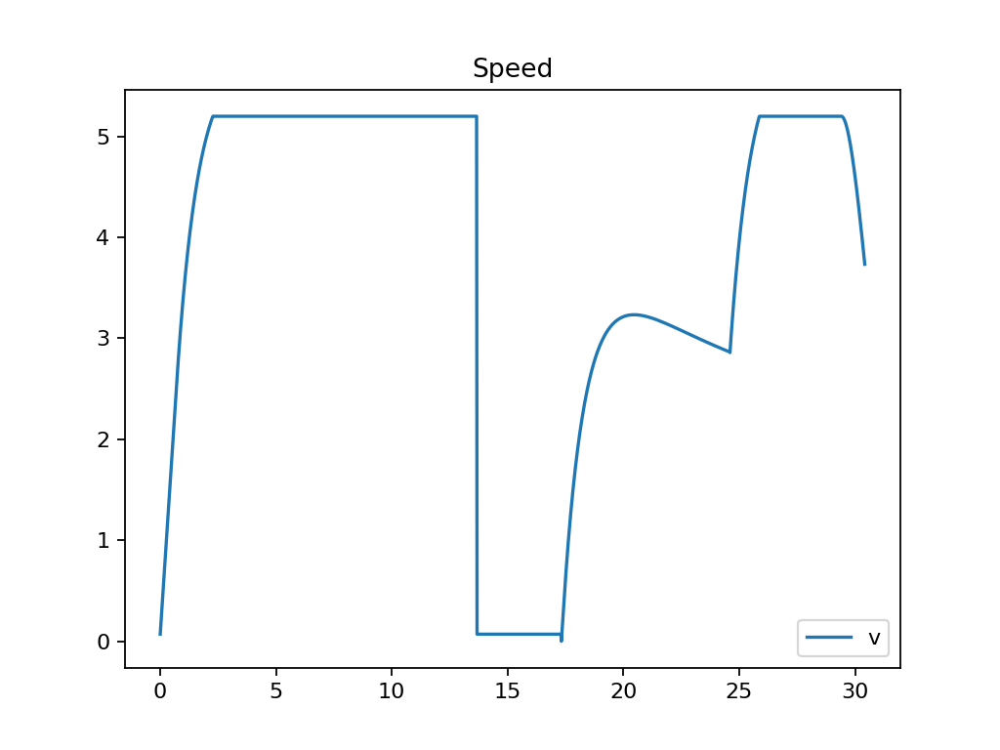

# Autonomous Ground Vehicle Simulation


Deterministic 2D autonomous ground vehicle simulation engine implemented in modern C++17.

This project integrates:

* Grid-based occupancy world model
* A* path planning (diagonal motion, no corner cutting)
* Kinematic bicycle vehicle model
* Pure Pursuit lateral control
* PID longitudinal speed control
* GPS, Radar, and LiDAR sensor simulation
* Deterministic Alpha-Beta target tracking
* Dynamic replanning (door-passage scenario)
* FNV-1a 64-bit golden hash regression verification

The system is designed as a **real-time autonomy architecture demo** emphasizing deterministic execution, modular subsystems, CSV observability, and reproducibility guarantees.

---

## Quick Start

Minimal build and run example:

```bash
cmake -S . -B build -G Ninja
cmake --build build -j
./build/agv_sim --mode static --seed 123 --hash 1
```

---

## Example Output (Replanning Door Scenario)




The replanning scenario demonstrates:

* Deterministic obstacle injection
* Reactive A* replanning
* Door alignment behavior
* Stable closed-loop control
* Bitwise-reproducible end-of-run hash

---

## System Overview

The simulation executes under a fixed timestep loop and deterministic RNG.

High-level pipeline per timestep:

```text
Sensor Simulation
→ Target Tracking
→ Goal Selection
→ Planning (A*)
→ Pure Pursuit Steering
→ PID Speed Control
→ Vehicle Integration
→ Collision Detection
→ Event Logging
→ CSV Output
```

Determinism is ensured via:

* Fixed `--dt`
* Seeded RNG (`--seed`)
* No wall-clock time usage
* Ordered CSV writes
* FNV-1a golden hashing

---

## Deterministic Simulation Core

* Fixed timestep loop (`--dt`, default 0.02s)
* Deterministic RNG (`--seed`)
* End-of-run FNV-1a 64-bit hash
* Smoke test for regression detection

Running identical commands with identical seeds produces identical hashes.

---

## World Model

* 2D occupancy grid (free / occupied)
* Deterministic obstacle placement
* Optional dynamic obstacle injection
* Collision detection when vehicle enters occupied cell
* Automatic recovery + replanning trigger

Map state is exportable via `map.csv`.

---

## Vehicle Model

### State

```text
(x, y, yaw, v)
```

### Control Inputs

```text
steer_rad, accel
```

### Dynamics

* Kinematic bicycle model
* Steering angle limits
* Acceleration bounds
* Max velocity constraint
* Deterministic integration

---

## Planning (A*)

Planner characteristics:

* Grid-based A*
* Diagonal motion allowed
* No corner cutting
* Plan ID tracking (`plan.csv`)

Replanning triggers:

* Moving target prediction updates
* Collision recovery
* Dynamic obstacle injection (door demo)
* Goal transitions

---

## Control Architecture

### Lateral Control – Pure Pursuit

* Waypoint tracking
* Configurable lookahead distance
* Deterministic curvature computation

### Longitudinal Control – PID

* `kp`, `ki`, `kd`
* Integral windup limiting
* Acceleration clamping
* Stable speed tracking

Control diagnostics exported via `control.csv`.

---

## Sensors

### GPS2D

* Noisy vehicle position
* `sigma_pos`
* `p_fix` probability of valid measurement

### Radar2D

* Noisy target position
* `sigma_pos`
* `p_detect`

### LiDAR2D

* Beam-based forward sampling
* Obstacle proximity detection
* Replanning trigger source

Sensor outputs logged to:

* `gps.csv`
* `lidar.csv`

---

## Target Tracking

Deterministic Alpha-Beta filter estimating:

* x̂, ŷ
* v̂x, v̂y

Outputs:

* `target_est.csv`

This module demonstrates lightweight real-time state estimation tightly coupled with planning.

---

## Run Modes

### Static Target

```bash
./build/agv_sim --mode static --seed 123 --out out_static --hash 1
```

Vehicle navigates to a fixed goal.

---

### Moving Target (Intercept)

```bash
./build/agv_sim --mode moving --seed 123 --noise_pos 2.0 --p_detect 1.0 --out out_moving --hash 1
```

Vehicle predicts future target position and intercepts deterministically.

---

### Replanning Demo (Door-Passage)

```bash
./build/agv_sim --mode replan_demo --seed 123 --out out_replan --hash 1
```

Deterministic event sequence:

```text
inject_wall_door
snap_to_approach
door_aligned
door_reached
REACHED goal
```

---

## Output Files

| File           | Description                         |
| -------------- | ----------------------------------- |
| truth.csv      | Ground-truth target state           |
| state.csv      | Vehicle state history               |
| plan.csv       | Planned waypoints (plan_id indexed) |
| control.csv    | Steering / accel / tracking error   |
| events.csv     | Replans, collisions, status         |
| target_est.csv | Tracker output                      |
| map.csv        | Occupancy grid dump                 |
| gps.csv        | GPS measurements                    |
| lidar.csv      | LiDAR diagnostics                   |

---

## Determinism & Smoke Test

```bash
./scripts/smoke.sh
```

Second consecutive run must print:

```text
[SMOKE] PASS
```

Baseline hashes (seed=123):

```text
static = c52c178345eb6a0a
moving = a1a5540b1e5e5be3
replan = e08f9d2c8ddeefbc
```

If hashes change, simulation logic or output formatting changed.

---

## Build (MSYS2 UCRT64 Example)

```bash
cmake -S . -B build -G Ninja
cmake --build build -j
```

Executable:

```text
build/agv_sim.exe
```

---

## Engineering Highlights

* Fully deterministic autonomy stack
* Integrated planning + tracking + control pipeline
* Dynamic replanning under obstacle injection
* Modular subsystem separation
* Extensive CSV observability
* Golden-hash regression safety
* Clean CMake + Ninja build

---

## Technologies

* C++17
* CMake
* Ninja
* Deterministic RNG
* Custom FNV-1a 64-bit hashing

---

## License

MIT

---

## Author

Ali Eray Kalaycı
Computer Engineering
Focus: Real-Time Systems, Tracking & Estimation, Autonomous Systems
